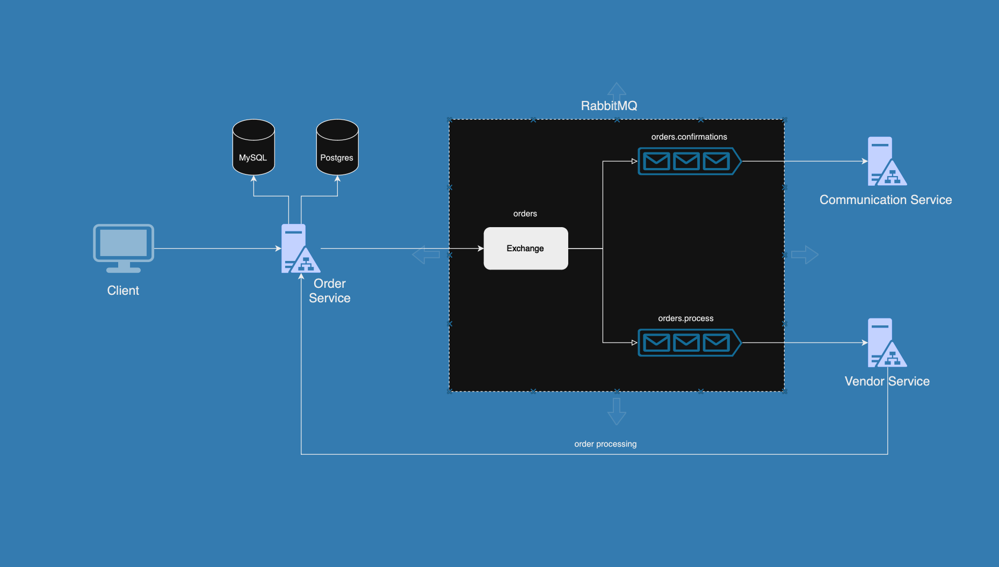

# Delivery System

## System Architecture and Flow



**Delivery-System** is an advanced, distributed food ordering platform that epitomizes modern, scalable architecture and robust design principles. Designed to handle complex, real-time food order processing, this platform showcases  implementation strategies. By leveraging a suite of microservices interconnected through asynchronous messaging, the Delivery-System delivers provides efficiency, fault tolerance, and flexibility in food order management.

### Key Highlights

- **Architecture:** At its core, the system uses a microservices architecture, enabling independent scaling and management of core functionalities. This approach ensures high availability and performance even under peak loads.
  
- **Asynchronous Messaging with RabbitMQ:** The system employs RabbitMQ with a fanout exchange pattern to efficiently distribute messages across multiple queues. This design choice enhances scalability and reliability by ensuring that messages are broadcast to all relevant services, improving fault tolerance and system responsiveness.

- **Dual Database Strategy:** To optimize performance and manage different types of data effectively, the Delivery-System integrates both PostgreSQL and MySQL databases. PostgreSQL is utilized for managing the menu data, while MySQL handles order details, demonstrating a sophisticated approach to database management and data segregation.

- **Scalable and Fault-Tolerant:** The system's design allows for seamless scaling of individual services, such as the `vendor_service` and `communication_service`. RabbitMQ's fault-tolerant mechanism ensures that no order is lost, even if a service fails, by re-queuing messages for retry, thereby maintaining high reliability.

- **Real-Time Order Tracking and Notifications:** Clients benefit from real-time order tracking and timely email notifications, thanks to the `order_service` and `communication_service`. To mirror real-world scenarios, the system includes a deliberate 30-second delay before updating the order status from 'accepted' to 'delivered'. This simulation acknowledges that actual order fulfillment takes time, providing a more authentic user experience.


## Architecture Overview

### Order Service

The `order_service` is a comprehensive component that plays a central role in managing menu data and processing orders. It is designed with two Django applications, each connected to a different database to demonstrate the seamless integration of multiple databases within a single project.

1. **Menu Application (`menu_app`)**:
   - **Functionality**: This application manages the entire menu for the platform, offering APIs to create, update, delete, and manipulate menu items. It consists of two models: `FoodItems` and `BarItems`, which represent the various food and beverage options available.
   - **Technology**: The `menu_app` uses PostgreSQL as its database, chosen for its robustness and scalability. The implementation leverages Django serializers to handle data validation and transformation, ensuring that menu data is consistent and easily accessible.
   - **Database Integration**: The use of database routers allows the `menu_app` to interact with PostgreSQL while coexisting with another app that uses a different database. This setup exemplifies how multiple databases can be effectively managed within a single Django project.

2. **Order Management Application (`order_manager_app`)**:
   - **Functionality**: This application is responsible for processing orders, including creating new orders, retrieving orders by their ID, and updating the order status as it progresses. It handles the core logic of the ordering process.
   - **Technology**: The `order_manager_app` utilizes MySQL for storing order data. This choice highlights the system's flexibility in handling different types of databases, showcasing the ability to work with both relational database systems within the same service.
   - **Asynchronous Messaging**: When an order is created, the `order_manager_app` publishes the order to a RabbitMQ exchange using the fanout technique. This approach ensures that the order is distributed to all relevant services, enabling real-time processing and communication across the system.

By designing the `order_service` with these two distinct Django apps, the system not only achieves its core functionality but also demonstrates advanced database management and inter-service communication techniques. This design choice showcases the ability to build scalable, maintainable, and efficient distributed systems.


### Communication Service

The **Communication Service** is responsible for handling all customer communications within the Delivery-System. It contains a single app, `email_service`, which plays a crucial role in keeping customers informed about their orders.

#### Key Features:

- **Email Service:** The `email_service` is the core component of the Communication Service. It operates as a Celery worker, which starts listening to RabbitMQ as soon as the service is up and running.
  
- **Message Consumption:** On startup, the Celery worker connects to the RabbitMQ `orders` exchange and listens to the `orders.confirmation` queue. Whenever a message is received, the service consumes it and triggers the `email_service` to send an order confirmation email to the client.

- **Scalability:** The Communication Service is designed to be independently scalable. As the demand for order confirmations increases, the service can be scaled horizontally to handle a higher load, ensuring timely email delivery to all customers.

- **Environment Variables:** To enable the service to send emails, two environment variables must be set:
  - `USER_EMAIL`: The email address that will be used to send order confirmations.
  - `USER_EMAIL_PASS`: The app-specific password for the `USER_EMAIL`. This password must be generated through the Google Account's security settings under "App Passwords."

These variables are critical as they provide the necessary credentials for the service to send emails. Any Gmail account can be used, and users need to generate an app-specific password through their Google Account and set its value here.

This service ensures that every order is promptly acknowledged via email, enhancing customer satisfaction and maintaining clear communication channels throughout the order process.


### Vendor Service

The **Vendor Service** is the backbone of the order processing workflow within the Delivery-System. It houses a single app, `restaurant_app`, which is crucial for managing the lifecycle of an order from acceptance to delivery.

#### Key Features:

- **Restaurant App:** The `restaurant_app` is the core component that handles order processing. Upon startup, it initiates a Celery worker that begins listening to the RabbitMQ `orders` exchange, specifically focusing on the `orders.process` queue.

- **Message Consumption:** When a new order is placed, the Celery worker in the `restaurant_app` consumes the message from the `orders.process` queue. It then interacts with the `order_service` to update the order's status to `accepted`, indicating that the restaurant has received the order and has begun processing it.

- **Order Status Update:** To mimic real-world scenarios where food preparation and delivery take time, the service incorporates a 30-second delay after accepting the order. Following this delay, the `restaurant_app` updates the order status to `delivered`, reflecting that the order has been completed and delivered to the customer.

This service is designed to handle orders in a realistic manner, allowing for smooth scaling as more restaurants (instances of the `restaurant_app`) are added to the system. This ensures that the Delivery-System remains efficient and reliable even as the demand for food orders increases.

## Setup and Deployment

To get the Delivery-System up and running, follow these steps:

### Prerequisites

Ensure you have Docker and Docker Compose installed on your system.

### Steps

1. **Clone the Repository:**
   Clone the repository to your local machine.
   ```bash
   git clone https://github.com/jayantreddy181198/delivery-system.git
   cd delivery-system
    ```

2. **Update Environment Variables:**
    Before starting the services, update the docker-compose.yml file with the correct environment variables. Pay special attention to the following:
        
        USER_EMAIL: Set this to the Gmail address that will be used to send order confirmation emails.
        
        USER_EMAIL_PASS: Set this to the app-specific password generated from your Gmail account.
     
    These variables are crucial for the communication-service to send emails successfully. You can use any Gmail account, but ensure you create an app password specifically for this purpose.

3. **Start the Services:**
    Run the following command to start RabbitMQ, PostgreSQL, MySQL, the communication-service, and the vendor-service:

    ```bash
    docker-compose up -d
    ```

4. **Create Databases:**
    After the services are up and running, you need to create the delivery_system database in both PostgreSQL and MySQL.

    Postgres:
    ```bash
        docker exec -it <postgres_container_id> psql -U postgres
        CREATE DATABASE delivery_system;
        \q
    ```

    MySQL:
    ```bash
        docker exec -it <mysql_container_id> mysql -u root -p
        CREATE DATABASE delivery_system;
        exit;
    ```

    Replace <postgres_container_id> and <mysql_container_id> with the actual container IDs or names of your PostgreSQL and MySQL containers.

5. **Start Order Service:**

    Once the databases are created, start the order_service by navigating into its directory and running the following commands:

    ```bash
    cd order_service
    make run
    ```


## Postman Collection 

    Link: https://github.com/jayantreddy181198/delivery-system/tree/main/postman_collection
    

## Conclusion

The Delivery-System is designed to provide a robust and scalable solution for food ordering and tracking. By leveraging asynchronous messaging and a distributed architecture, it ensures a smooth and reliable experience for both clients and service providers.
